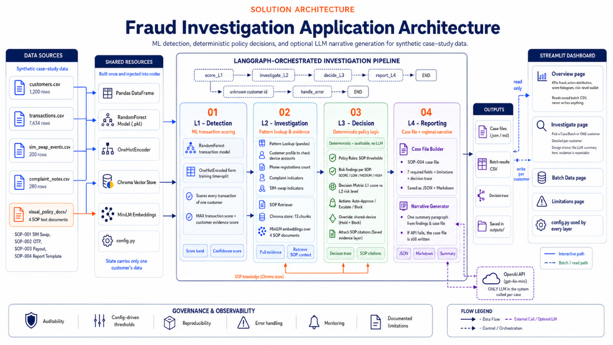
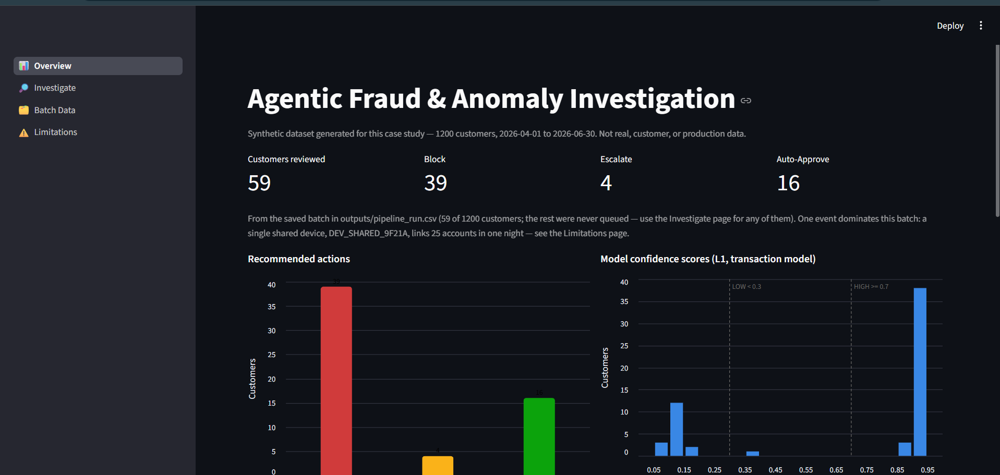
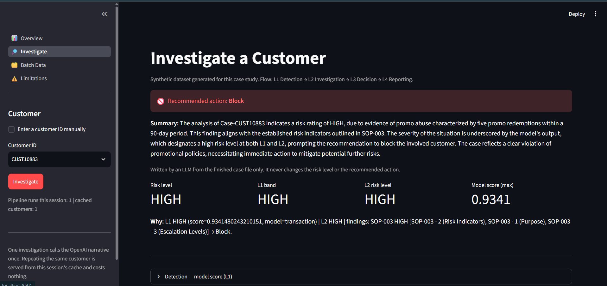
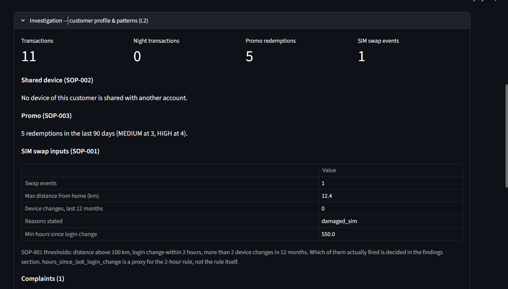

# Agentic Fraud & Anomaly Investigation

An end-to-end **agentic investigation pipeline** for telco fraud: it takes one customer from an
ML risk score, through policy retrieval and evidence lookup, to a deterministic decision and an
auditable case file — orchestrated with LangGraph and served as a Streamlit decision dashboard.

Built on a **synthetic** labeled dataset. Personal learning / DS-AI mentoring project, not
production software.



## Flow

- **L1 Detection** — ML / rule scoring producing a confidence score per customer.
- **L2 Investigation** — RAG over `fraud_policy_docs/` (SOP-001..004) plus historical pattern lookup.
- **L3 Decision** — weighs L1 + L2 findings against policy thresholds, emits Auto-Approve / Escalate / Block.
- **L4 Reporting** — compiles a structured, auditable case file in SOP-004 format.

Fraud types in scope: shared-device topup rings, SIM-swap account takeover, promo abuse.

## Dashboard

`streamlit run app/main.py` — overview first, then drill down into one customer.

**Overview** — batch KPIs, action distribution, and the confidence-score histogram with both
`config.py` cut points drawn on it.



**Investigate** — the decision leads: banner, risk level, L1 band, L2 risk level, and the
`Why:` trace naming every SOP section that fired. The paragraph above it is the LLM narrative,
written from the finished case file and unable to change either field below it.



**Evidence** — each layer's raw inputs sit in collapsed expanders, with the SOP thresholds shown
next to the values they are compared against, so a reviewer can disagree with the decision.



## Design decisions worth knowing

1. **The LLM never decides.** Risk level and recommended action are resolved by a deterministic
   `L1 band x L2 risk` matrix. The LLM writes one `narrative_summary` field, outside the seven
   SOP-004 fields, and `attach_narrative()` asserts it changed neither.
2. **Every finding cites its SOP clause.** Retrieval is scoped by `doc_id` to the document the L1
   category implies, so a citation always points at the right SOP — see the honesty note below for
   what that does *not* buy.
3. **One customer = one case file.** The decision layer runs per customer profile, so any other
   grain would mean reopening L3.
4. **L4 recomputes nothing.** Risk level and action are copied verbatim from the decision object;
   an `if` in the reporting layer that changes either one is a bug, and the test suite checks it.

## Data

All data under `data/` is **synthetic**, generated for this case study — never real, customer,
or production data. Event tables span 2026-04-01 to 2026-06-30, joined on `customer_id`
across 1,200 customers.

| file | rows | label |
|---|---|---|
| `customers.csv` | 1,200 | — |
| `transactions.csv` | 7,634 | `is_fraud_label`, 2.69% positive |
| `sim_swap_events.csv` | 200 | `is_fraud_label`, 10.0% positive |
| `complaint_notes.csv` | 280 | `related_to_fraud_case` (proxy only), 21.4% positive |

## Results

All numbers below were measured by running this repo. Splits are **time-based**
(train 2026-04-01..05-31, test 2026-06-01..06-30), never random.

**L1 — detection**

| task | model | precision | recall | F1 | PR-AUC |
|---|---|---|---|---|---|
| transaction fraud | Random Forest (tuned) | 0.262 | 1.000 | 0.415 | 0.788 |
| SIM swap | SOP-001 rule, 2+ indicators | 0.952 | 1.000 | 0.976 | — |
| SIM swap | Logistic Regression | 0.333 | 0.727 | 0.457 | 0.331 |

The SIM-swap rule beats the model it was benchmarked against — the baseline stayed.

**L2 — retrieval, dense vs. sparse** (13-question eval set over the 4-SOP corpus)

| retriever | recall@1 | recall@3 |
|---|---|---|
| Chroma + all-MiniLM-L6-v2 | 9/13 | 13/13 |
| TF-IDF baseline | 8/13 | 10/13 |

**L3/L4 — decision and reporting** (59-customer batch at live model scores)

| check | result |
|---|---|
| action split | Block 39 / Auto-Approve 16 / Escalate 4 |
| findings without an SOP citation | 0 of 124 |
| L4 rows where risk level or action drifted from L3 | 0 of 119 |

**Orchestration — is the framework earning its place?**

| | LangGraph | plain sequential calls |
|---|---|---|
| lines to wire | 17 | 9 |
| per customer | ~123 ms | ~128 ms |

On this fixed four-step flow LangGraph is cost-neutral and eight lines longer. It stays in
because the conditional-edge and state-trace machinery is the point of the exercise — but the
comparison is reported, not hidden.

## Honest limitations

These are findings, not disclaimers — a portfolio project that hides them is the failure mode.

- **The dataset leaks.** Every promo redemption row carries label 1, every fraudulent topup is the
  same payment method inside the same four-hour window, and one device is shared across 25
  accounts while every other device is 1:1. A model scoring near-perfect here has learned the
  generator, not fraud — so the reported model is the one trained *without* the promo leak.
- **RAG buys traceability, not precision.** Each SOP has only four chunks, so with top-k 3 and a
  `doc_id` filter a citation list is effectively "three of the four sections of the right
  document". The similarity threshold filters nothing at this corpus size.
- **No SOP has a grey case in this data.** L3 is verified correct against its own spec; it is
  *not* verified to make good decisions on hard ones. Only 6 of the 12 decision-matrix boxes are
  reachable, because no SOP can emit a LOW risk level on this dataset.
- **The shared-device ring costs 25 near-identical reports.** One customer = one case file means
  no field anywhere says those 25 accounts belong to a single event.

## Repo structure

```
config.py                      paths + all SOP thresholds
data/                          read-only synthetic CSVs
fraud_policy_docs/             L2 RAG corpus (SOP-001..004)
src/
  data_io.py                   generic load/parse + time-based split
  features/                    L1 feature builders (transaction, SIM swap)
  detection/                   L1 baseline rules, model, evaluation
  investigation/               L2 RAG retriever + pattern lookup
  decision/                    L3 policy thresholds -> decision
  reporting/                   L4 SOP-004 case file + optional LLM narrative
  pipeline/                    controller: LangGraph nodes + state, no domain logic
app/                           view layer: Streamlit dashboard
  views/                       overview / investigate / batch data / limitations
notebooks/                     NN_<layer>_<topic>, one per derived module
outputs/                       artifacts: MLflow db, Chroma index, models, case files (gitignored)
tests/e2e/                     35 UAT tests: Streamlit AppTest + Playwright
```

## Setup

Python 3.11.9.

```
python -m venv .venv
.venv\Scripts\activate
pip install -r requirements.txt
```

Build the RAG index once (notebook `03_L2_sop_retriever_rag.ipynb`), then:

```
streamlit run app/main.py          # dashboard
pytest tests/e2e -m "not slow"     # E2E suite, no API calls
mlflow ui --backend-store-uri "sqlite:///outputs/mlflow.db" --workers 1
```

The optional L4 narrative needs `OPENAI_API_KEY` in `.env`; without it the case file is still
written, just without the narrative section. MLflow and Chroma both run locally — no hosted
services anywhere in this repo.

> **Windows note:** `import chromadb` must run before `import pandas`, and `mlflow ui` needs
> `--workers 1`. Both were found by failing runs; details in `CLAUDE.md`.
